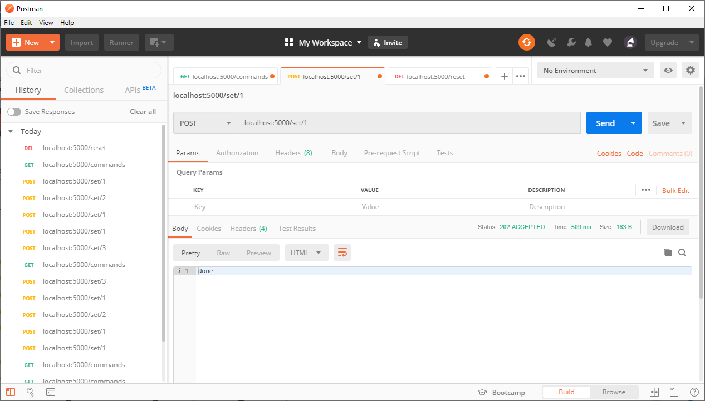
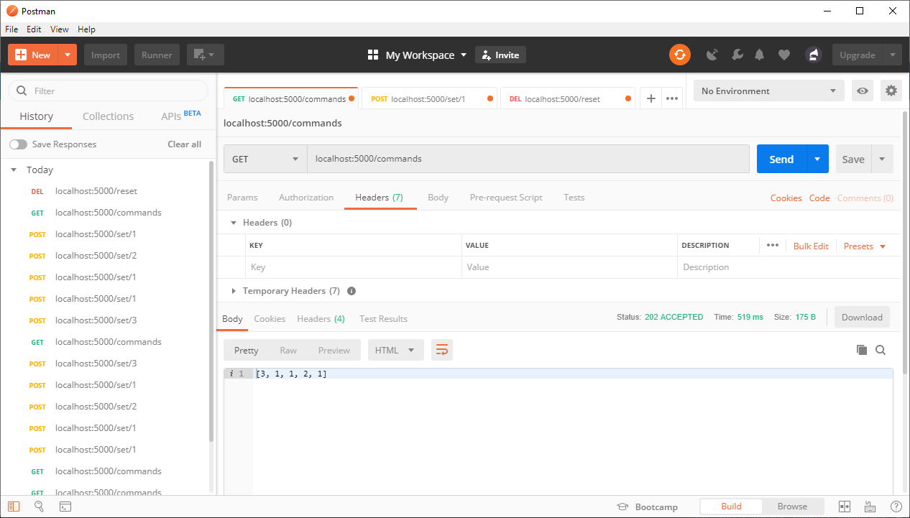
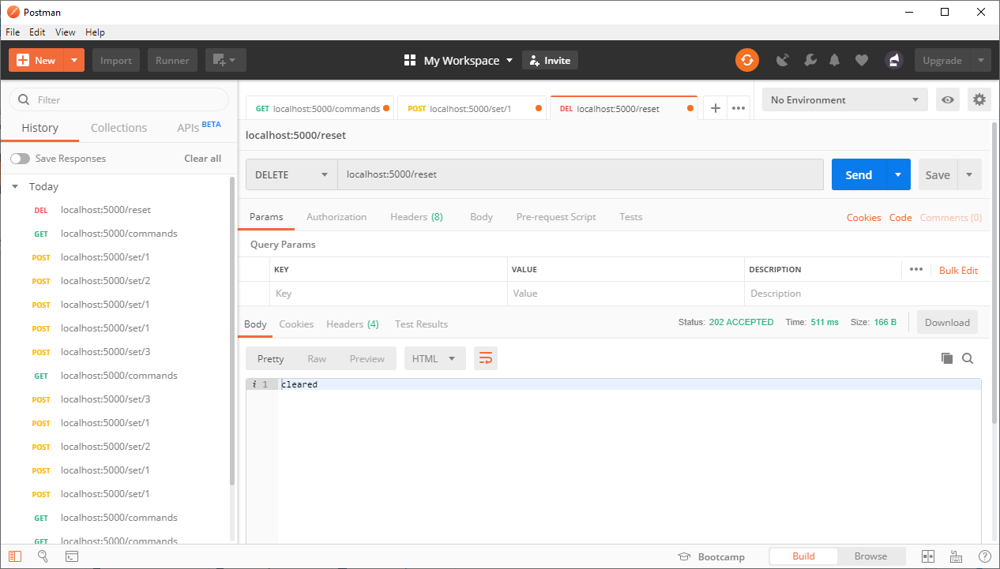
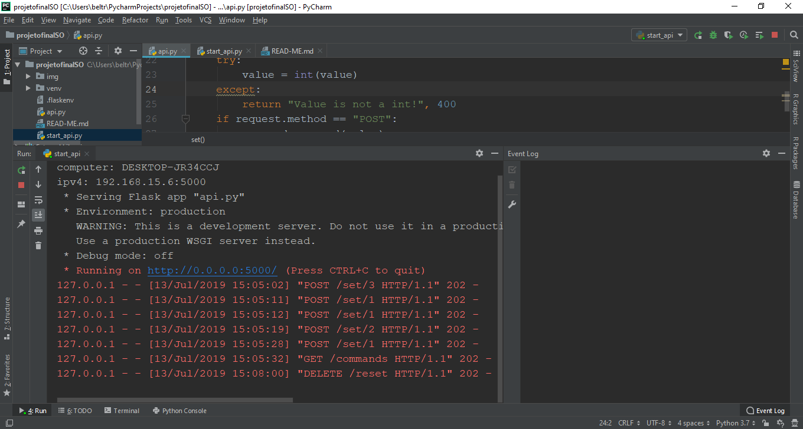

#Projeto final de Sistemas Operacionais

## Servidor flask

Por ser baseado em python a framework flask foi escolhida devido a sua simplicidade deimplementação. de modo que com poucas linhas foi possível implementar uma serie de APIs REST para o projeto

### dependencias
* Python 3.7
* configurar as variáveis de ambiente para incluir os diretorios onde estão localizados os arquivos python.exe e pip.exe
* pip install flask
* pip install flask_cors
* pip install python-dotenv

### Notas
* o projeto foi desenvolvido com a IDE:  
PyCharm 2019.1.3 (Professional Edition)
Build #PY-191.7479.30, built on May 29, 2019
Licensed to Luís Henrique Beltrão Santana
Subscription is active until January 30, 2020
For educational use only.
JRE: 11.0.2+9-b159.60 amd64
JVM: OpenJDK 64-Bit Server VM by JetBrains s.r.o
Windows 10 10.0
* caso a IDE esteja aberta durante o processo de configuração das variáveis de ambiente será necessário reinicia-la
* para executar o servidor basta executar o script start_api.py
* Por padrão o servidor usa a porta 5000
* o servidor flask foi configurado via o script de inicialização para operar em toda a rede, o script de inicialização irá fornecer o ip da maquina em que o servidor está sendo executado via um print no terminal
* o metodo delete no navegador chama antes o metodo options para garantir a segurança da operação, o cors deve estar configurado no flask para tratar essa requisição

###Testes

teste para a api de inserir dados  

teste para a api de exibir a lista de comandos  

teste para a api de limpar os dados  

log do servidor

### Tutoriais vistos
> [set up](https://realpython.com/flask-by-example-part-1-project-setup/)  
> [Flask: Hello World!](https://blog.miguelgrinberg.com/post/the-flask-mega-tutorial-part-i-hello-world)  
> [Methods](http://blog.luisrei.com/articles/flaskrest.html) 
> [REST codes](https://restfulapi.net/http-status-codes/)  
> [Problema com OPTIONS ao invés de DELETE!](https://stackoverflow.com/questions/19962699/flask-restful-cross-domain-issue-with-angular-put-options-methods)  
> [Flask CORS](https://pypi.org/project/Flask-Cors/)

## Angular

visando uma implementação resiliente e de boa performace foi excolhida a framework angular para a interação do usuário com o servidor, a codificação empregada é o typescript, que por ser uma linguagem fracamente tipada é bem resistente a erros.  
Outra vantagem do Angular é que a framework faz um bom uso da metodologia reativa que permite tratar evenjtos asincronos de maneira simplificada, uma vez que se entenda o paradigma de programação reativa

### Dependencias
* NodeJS 10.16.0
* npm 6.9.0
* Angular 8.2.0
* Bootstrap 4.3.1
* npm install bootstrap@4.3.1
### Notas
* O projeto foi desenvolvido com a IDE:  
WebStorm 2019.1.3
Build #WS-191.7479.14, built on May 27, 2019
Licensed to Luís Henrique Beltrão Santana
Subscription is active until January 30, 2020
For educational use only.
JRE: 1.8.0_202-release-1483-b53 amd64
JVM: OpenJDK 64-Bit Server VM by JetBrains s.r.o
Windows 10 10.0
* por padrão o servidor usa a porta 4200
* o servidor não estã configurado para operar em rede de modo que só irá funcionar no computador onde está sendo executado
### Tutoriais vistos
[HttpClientModule](https://www.djamware.com/post/5b87894280aca74669894414/angular-6-httpclient-consume-restful-api-example)
## TI-RTOS
